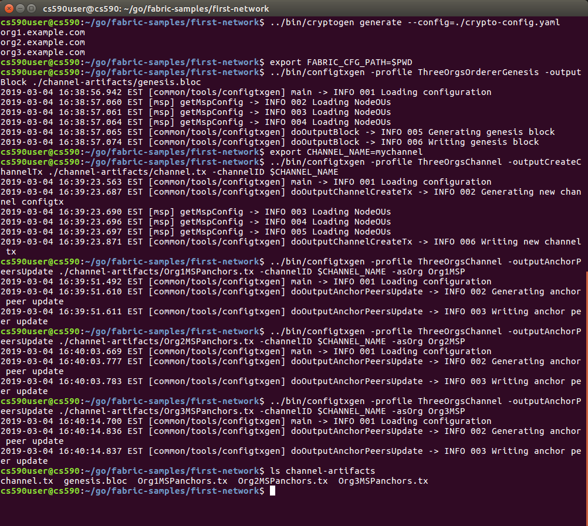
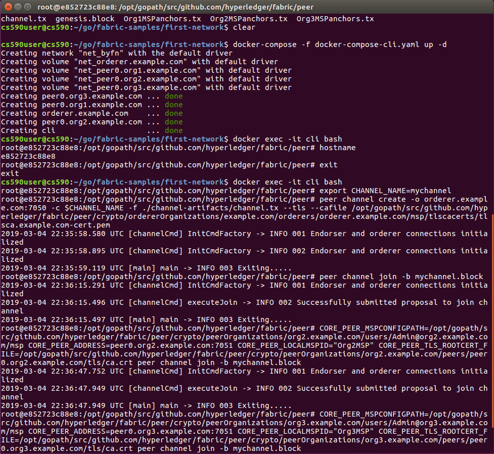
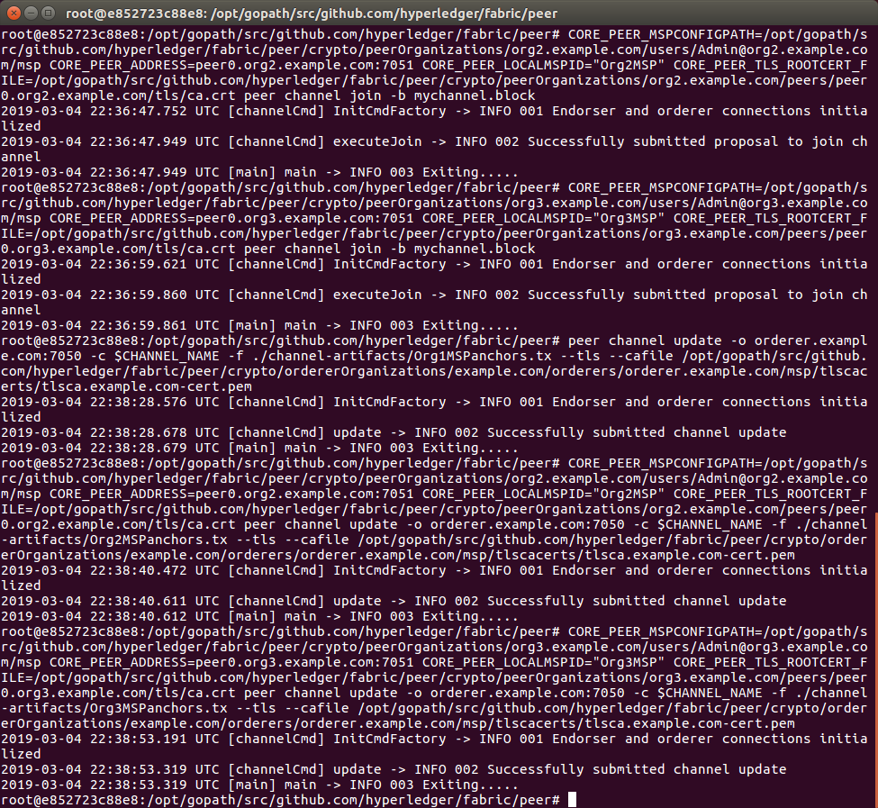
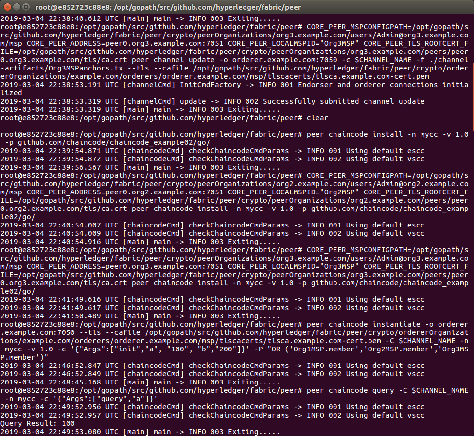
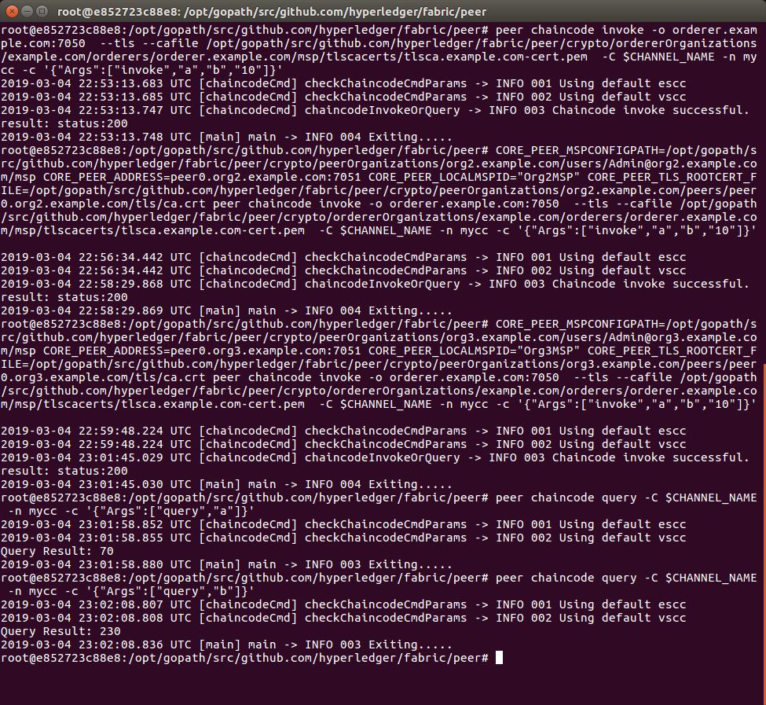

#### Seungchuel Kim

#### Professor Kate

#### CS590BTS

#### March 1, 2019

 

### Task 1

- Task 1.1 & 2 Generate Network Artifacts and Edit Docker Compose Files

    - This network is modifed from the first-network for three organizations, each with one peer node, and a solo ordering service. Matching the required structure, artifacts, and genesis block, anchor peer transition for each org, and channel creation are successfully generated and printed. The first network totally works

- Task 1.3 Run Sample Chaincodes

    - The chaincode succesfully runs as well as querying and invoking.

 

### Task 2

- Task 2.1

- Task 2.2

 

### Task 3
